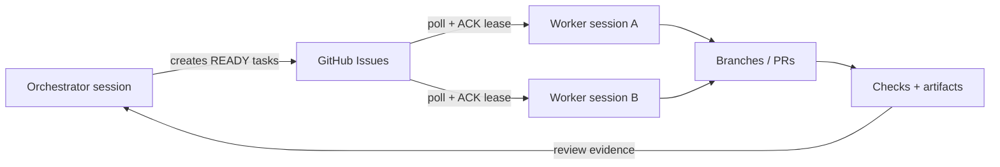

<p align="center">
  
</p>

<p align="center">
  <strong>Models reason. GitHub remembers. Maestaris conducts.</strong>
</p>

<p align="center">
  <a href="https://github.com/Siddharthgolecha/Maestaris/actions/workflows/validate-maestaris.yml"></a>
  <a href="https://github.com/Siddharthgolecha/Maestaris/releases/latest"></a>
  
  <a href="LICENSE"></a>
  <a href="https://github.com/Siddharthgolecha/Maestaris/stargazers"></a>
  
</p>

Maestaris is a lightweight orchestration protocol for running **long-lived projects with ordinary web-hosted LLM conversations**. Model sessions can act as orchestrators or specialist workers while GitHub provides the durable coordination layer.

> **Any model session may disappear. The project must still be reconstructible from GitHub.**

## Why Maestaris

- **Persistent by design** — tasks, ACKs, results, reviews, evidence, and provenance live in GitHub.
- **Model-provider agnostic** — ChatGPT, Gemini, Claude, local agents, API agents, and other runtimes can share the same protocol.
- **Safe parallel work** — ACK leases, stable task IDs, and idempotent state transitions reduce duplicate work.
- **GitHub-native** — Issues are tasks, PRs are work, Actions handle mechanical checks, and Projects provides the mission board.
- **No always-on daemon required** — ordinary chats or scheduled sessions can poll GitHub and continue where another session stopped.

## How it works



GitHub events can trigger Actions, but they cannot directly wake a normal web-hosted chat. Maestaris therefore separates **event-driven GitHub automation** from **safe model-session polling**.

## Quick start

Use Maestaris as a template or copy its coordination layer into an existing repository.

```bash
python -m pip install -e .

maestaris init my-project \
  --workers theory implementation audit \
  --repository owner/repository

maestaris validate
```

Then point a fresh model session at the repository:

```text
Use Maestaris on OWNER/REPO as orchestrator.
```

or:

```text
Use Maestaris on OWNER/REPO. Act as worker pool A.
```

The repository's root [AGENTS.md](AGENTS.md) is the bootstrap contract for fresh sessions.

## Core protocol

A task typically moves through:

```text
READY → ACK/CLAIMED → PR + evidence → DONE / BLOCKED / NEEDS_REVIEW
                                      ↓
                          ACCEPTED / REVISE / REJECTED
```

Live orchestration state stays in GitHub Issues, comments, PRs, checks, and history rather than a second mutable YAML state machine.

## Documentation

| Start here | Deep dive |
| --- | --- |
| [Quick start](docs/quickstart.md) | [Architecture](docs/architecture.md) |
| [Protocol](docs/protocol.md) | [GitHub-native integration](docs/github-native.md) |
| [GitHub Projects](docs/github-projects.md) | [Multi-AI orchestration](docs/runtime/multi-ai-orchestration.md) |
| [ChatGPT scheduled runtime](docs/runtime/chatgpt-scheduled.md) | [Failure recovery](docs/failure-recovery.md) |
| [Releases & versioning](docs/releases.md) | [Scaling](docs/scaling.md) |

## Design principles

**Chats are workers. GitHub is memory.**  
**Issues are tasks. PRs are work. Evidence beats summaries.**  
**Preserve invariants, not template shape.**

## License

MIT — see [LICENSE](LICENSE).
